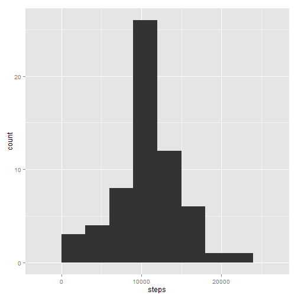
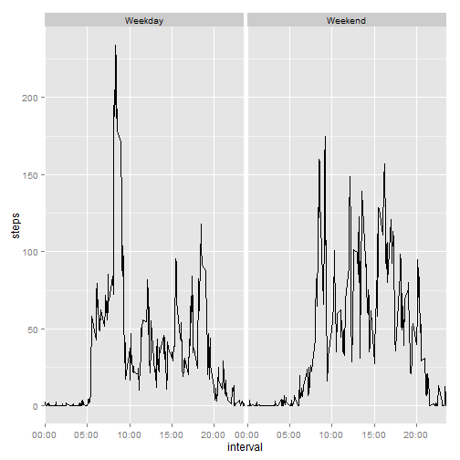

## Loading and preprocessing the data

### Loading the data

The data is stored in a zip file in the same repository as this Markdown file, so it is only necessary to unzip the data file ("activity.zip") and read the CSV. I always use read.table, it is easier for me to use always the same function, so I will use that one even though this file might fit with the requirements of read.csv. The column classes were guessed after a look into the file from the operating system ("head activity.csv").


```r
data.zip.name <- "activity.zip"
data.file.name <- "activity.csv"
colClasses <- c("numeric", "character", "numeric")
unzip(data.zip.name)
activity <- read.table(data.file.name, header=TRUE, sep=",", colClasses=colClasses)
```

### Preprocessing

The identification of the time of the measurements seems to require some preprocessing. The intervals are indicated with a number, in which actually the first two significant digits indicate hour of day and the last two digits indicate minute. This can be changed to a POSIXlt time by adding the number of seconds to the transformation of the "date" column into POSIXlt. I will create a new column called "datetime" with this variable containing the time of each measurement.


```r
activity$seconds <- ((((activity$interval %/% 100) * 60) + (activity$interval %% 100)) * 60)
activity$datetime <- strptime(activity$date, format="%F") + activity$seconds
```


## What is mean total number of steps taken per day?

To calculate this, we first need to compute the number of steps per day, using e.g. the aggregate function.


```r
steps.per.day <- aggregate(steps ~ date, activity, sum, na.rm=TRUE)
library(ggplot2)
ggplot(data=steps.per.day, aes(x=steps)) + geom_histogram(binwidth = 3000)
```

 

Then we pass the result to the mean and median functions.


```r
total.mean.per.day <- mean(steps.per.day$steps)
total.median.per.day <- median(steps.per.day$steps)
```

The result of the calculation returns a value of 10766.19 mean steps taken per day, and 10765 as the value of the median per day.

## What is the average daily activity pattern?

Let's look now at the activity pattern during a day. In order to do this, we average steps across each of the intervals during a day.


```r
steps.per.time.of.day <- aggregate(steps ~ interval, activity, mean, na.rm=TRUE)
max.steps <- max(steps.per.time.of.day$steps)
max.steps.interval <- steps.per.time.of.day[steps.per.time.of.day$steps == max.steps,1]
day.pattern <- ggplot(data=steps.per.time.of.day, aes(x=interval, y=steps))
day.pattern <- day.pattern + geom_line()
day.breaks <- c(0,500,1000,1500,2000)
day.breaks.time <- c("00:00","05:00","10:00","15:00","20:00")
day.pattern <- day.pattern + scale_x_discrete(breaks=day.breaks,labels=day.breaks.time)
day.pattern
```

 

The maximum value of average steps across all days is 206.17, which happens at 08:35.

## Imputing missing values

Let's take a look now at the number of missing values in the dataset and asses whether they need to be covered somehow in order to produce valid results.
To start with, the total number of missing values is 2304 out of 17568. This seems to be a very relevant fraction of the measurements.
In order to improve the accuracy of the results, we will replace each missing value with the mean value for that time of day in the same interval.


```r
activity.filled.in <- transform(activity, 
                      steps = ifelse(is.na(steps), 
                                     steps.per.time.of.day[1+(seconds/300),2], 
                                     steps))
```

Now we look at the total number of steps per day again to see if there are any differences.


```r
steps.per.day.filled.in <- aggregate(steps ~ date, activity.filled.in, sum)
total.mean.per.day.filled.in <- mean(steps.per.day.filled.in$steps)
total.median.per.day.filled.in <- median(steps.per.day.filled.in$steps)
ggplot(data=steps.per.day.filled.in, aes(x=steps)) + geom_histogram(binwidth = 3000)
```

 

The new histogram shows a difference in that now we see several days more with a total number of steps equal to the mean value. The rest of the graph is exactly the same.

The result of the new calculation returns a value of 10766.19 mean steps taken per day, and 10766.19 as the value of the median per day. As expected, the mean is the same since new values have the same value as the mean. The median has changed a bit (it should have moved towards the mean) since there are now more days with the same value as the mean value. The difference doesn't seem noticeable if we look at the total number of steps either. After looking a bit more into the missing values, it seems that they all correspond to complete missing days (2012-10-01, 2012-10-08, 2012-11-01, 2012-11-04, 2012-11-09, 2012-11-10, 2012-11-14, 2012-11-30).

It can be checked with the following code, which returns the number of non NA values for the dates with any NA value (should return 0):


```r
sum(!is.na(activity[activity$date %in% unique(activity[is.na(activity$steps),]$date),1]))
```

```
## [1] 0
```

This explains why there is relevant impact in the summarized values, even though the number of missing values seems significant.

## Are there differences in activity patterns between weekdays and weekends?

Let's compare the daily pattern of weekdays with that of the weekend. We use the original data, since the filling-in in the previous section didn't take into account weekends and it could therefore mislead the results.


```r
activity$isWeekend <- as.POSIXlt(activity$datetime)$wday %in% c(0,6)
activity$isWeekend <- ifelse(activity$isWeekend, "Weekend", "Weekday")
act.final <- aggregate(steps ~ interval + isWeekend, data=activity, FUN=mean)
day.pattern2 <- ggplot(data=act.final, aes(x=interval, y=steps))
day.pattern2 <- day.pattern2 + geom_line()
day.pattern2 <- day.pattern2 + facet_grid(. ~ isWeekend)
day.pattern2 <- day.pattern2 + scale_x_discrete(breaks=day.breaks,labels=day.breaks.time)
day.pattern2
```

 

There are clear differences in the patterns, as it would have been expected. There is a higher activity earlier in the morning during the weekdays and a overall higher activity later in the day during weekends, which seems reasonable.
